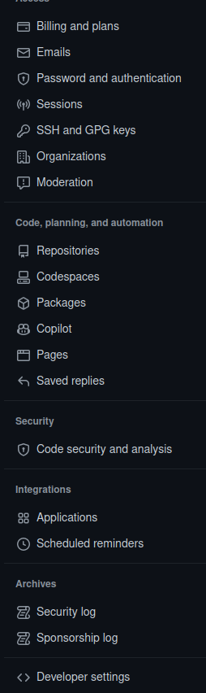
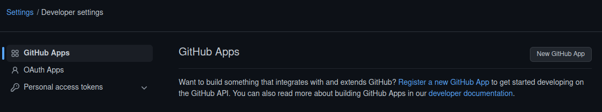
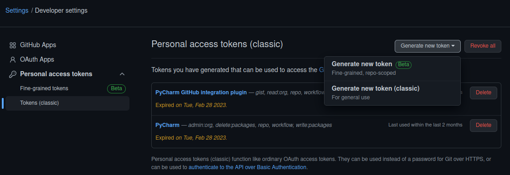
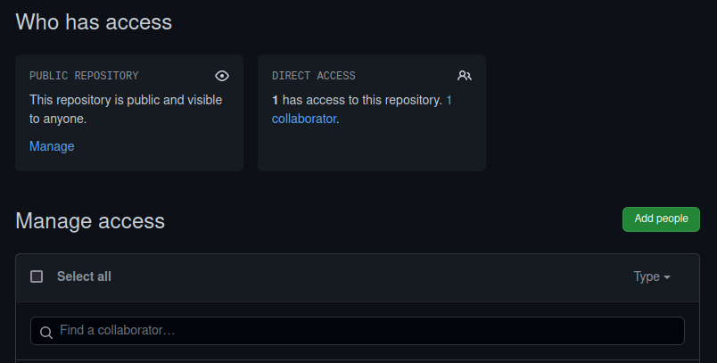

# git and github

## setup git

you can use the command to install git in Ubuntu22.04 or Ubuntu18.04:

$ sudo apt-get install git

## github
Git is a useful software for version control of software engineering.

It can be more powerful if you manage your code in github.

###
you need sign up an account in the webpage as follows:

https://github.com/signup?ref_cta=Sign+up&ref_loc=header+logged+out&ref_page=%2F&source=header-home

## Sign up and sign in
if you sign up information as follows:

User name: gituser

User email: gituser@email.com

###
you can sign in from the site:

https://github.com/login

## Set personal profile
you can set you profile from the setting

## Create personal access token

you need create your personal token develop your repositories from Developer settings.

when you press the button of "Generate token", the system will generate a token, you need copy it asap because it will not be shown with you again.

it is used as password when you push your code from local up to remote.

## Create your first repository
you can create a new repository or import others' repository as yours:

if your repository named as newrepo, you can create a local file path named as newrepo,

$ echo "# newrepo" >> README.md

$ git init

$ git add README.md

$ git commit -m "first commit"

$ git branch -M main

$ git remote add origin git@github.com:htchentyut/newrepo.git

$ git push -u origin main

## Version control
you can invite collaborators by their names using the button "Add people" in "Manage access" of "Repositories".

