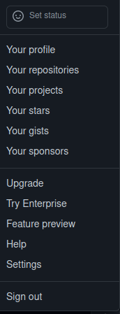

# git and github
git is a useful software for version control of software engineering.
## setup git
you can use the command to install git in Ubuntu22.04 or Ubuntu18.04:

$ sudo apt-get install git

## github
Git can be more powerful if you manage your code in github.

###
you need sign up an account in the webpage as follows:

https://github.com/signup?ref_cta=Sign+up&ref_loc=header+logged+out&ref_page=%2F&source=header-home

## Sign up and sign in
if you sign up information as follows:

User name: gituser

User email: gituser@email.com

###
you can sign in from the site:

https://github.com/login

## Set personal profile
you can set you profile from the setting

## Create personal access token

you need create your personal token develop your repositories from Developer settings.

when you press the button of "Generate token", the system will generate a token, you need copy it asap because it will not be shown with you again.

it is used as password when you push your code from local repository up to remote repository.

## Create your first repository
you can create a new repository or import others' repository as yours:

if your repository named as newrepo, you can create a local file path named as newrepo,

$ echo "# newrepo" >> README.md

$ git init

$ git add README.md

$ git commit -m "first commit"

$ git branch -M main

$ git remote add origin git@github.com:$gituser/newrepo.git

$ git push -u origin main

when you push your repository from terminal, you need input the username "gituser" and token for the upload. 
## branch shown
$ git branch #local

$ git branch -r #remote

$ git branch -a #all
## Create new branch
you can create new branch as follows:

$ git branch newbranch # local 

or

$ git checkout -b localbranch origin/remotebranch

## checkout branch
$ git checkout branchname # local

and

$ git checkout -b branchname # remote

## remove branch
$ git branch -d brnachname # local

$ git push origin --delete branchname # remote

## merge branch
$ git checkout master # checkout to master branch

$ git merge dev # merge dev to master
## Version control and collaborator
you can invite collaborators by their names using the button "Add people" in "Manage access" of "Repositories".

Then the person you invited can find the link to join the development of repository from the organizations of his own account.

He need create a new fork based on the shared repository. He can push the new version and create pull requests.

The repository owner will find the requests on in his own repository page.
